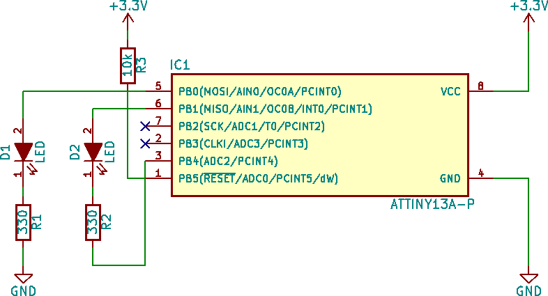

# ATtiny13(A) based fireflies
This is a very cool weekend project based on a ATtiny13A mikrocontroller.

My project is a merge of some other project I found on github.

https://github.com/kjordahl/Pyralis  
https://github.com/colinmeyer/ATtiny13_firefly

And of course the original project inspiration

http://www.seanet.com/~karllunt/fireflyLED.html

I added a second led, pwm control and idle mode while using the pwm for the blinking sequence to improve the power consumption.

For the build you will only need:
- 1 x ATtiny13A (with minor changes it is possible to use a ATtiny13)
- 1 x 10kOhm resistor
- 2 x 330Ohm resistor
- 2 x LED with (~2V Forward voltage)
- 1 x CR2032 coin cell

